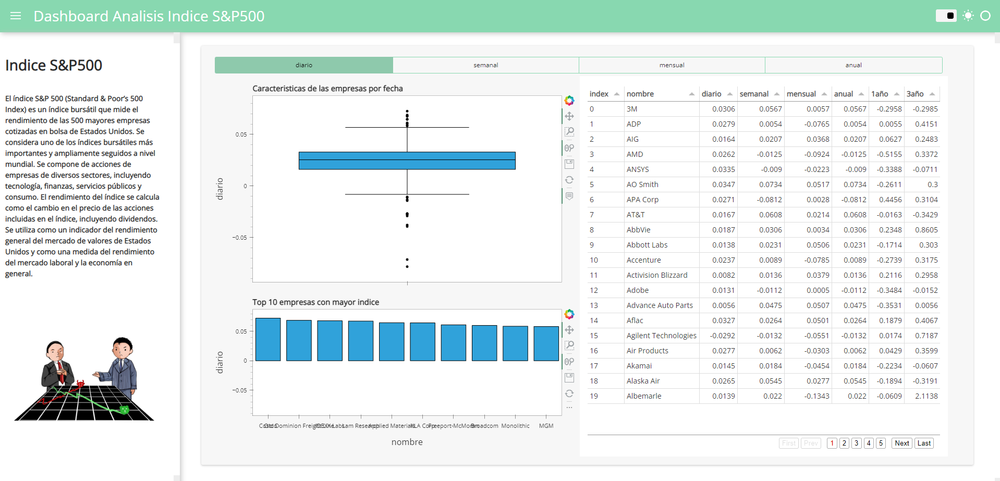

  

# 📈 S&P 500 Market Analysis

## 📊 Tools & Skills

Python • Pandas • Data Analysis • Financial Analysis • Power BI • Data Visualization

---

## 📌 Project Overview

This project analyzes historical S&P 500 data to identify trends, volatility, and market behavior.

The goal is to simulate real-world financial analysis used by analysts and investors.

---

## 🎯 Business Problem

Investors need to understand market behavior to make informed decisions.

This project answers:

* How has the S&P 500 evolved over time?
* What patterns can be identified?
* How can data support investment strategies?

---

## 📈 Key Insights

* Identified long-term market growth trends
* Detected periods of high volatility
* Observed recurring patterns in market behavior

---

## ⚙️ Data Process

* Data cleaning with Python
* Exploratory Data Analysis (EDA)
* Trend analysis
* Dashboard creation in Power BI

---

## 🛠️ Tools Used

* Python (Pandas)
* Power BI
* Data Visualization

---

## 🚀 Outcome

This project provides insights into market behavior, helping investors understand trends and risks.

---

## 💡 Business Value

This analysis helps:

* Identify investment trends
* Understand market volatility
* Support data-driven financial decisions
